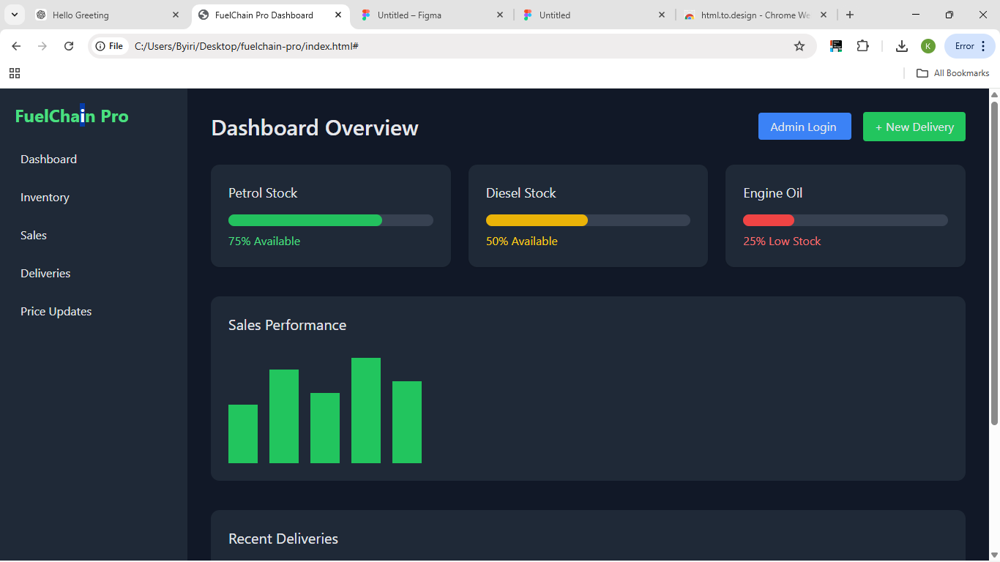
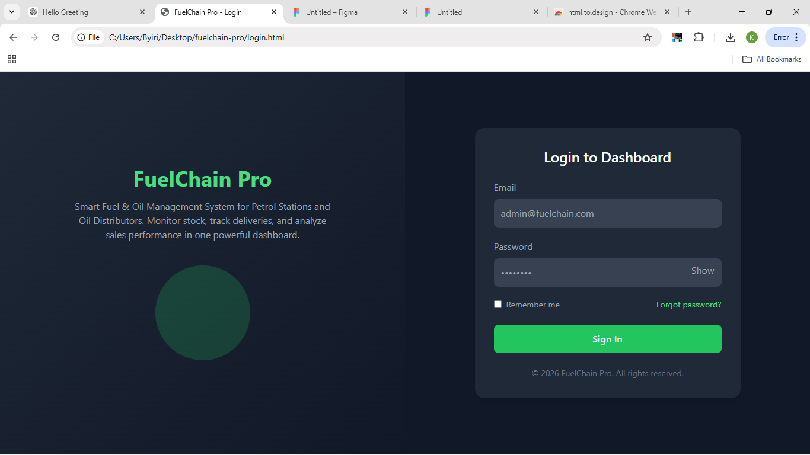

#  FuelChain Pro  
### Smart Fuel & Oil Management System (Frontend Only)

FuelChain Pro is a modern frontend dashboard designed for petrol stations and oil distributors to manage fuel stock, sales performance, and delivery tracking.

This project was built using:

- HTML5
- Tailwind CSS
- Basic JavaScript (for UI interactions)
- Responsive Admin Dashboard Layout

## Project Overview

FuelChain Pro is a professional petroleum management interface that allows administrators to:

- Monitor fuel stock levels
- Visualize sales performance
- Track delivery activities
- Manage price updates
- Login to an admin dashboard

    ## author
  name: komezusenge byiringiro
  reg no: 25RP00634
  module:frontend development
  

This version focuses 100% on frontend development.

## screen shoot

